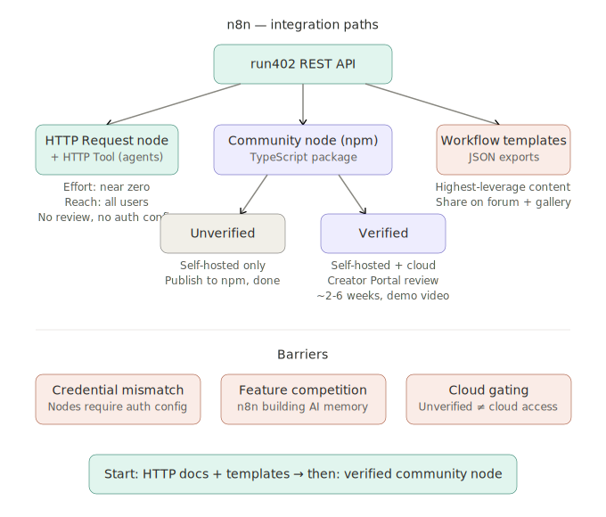
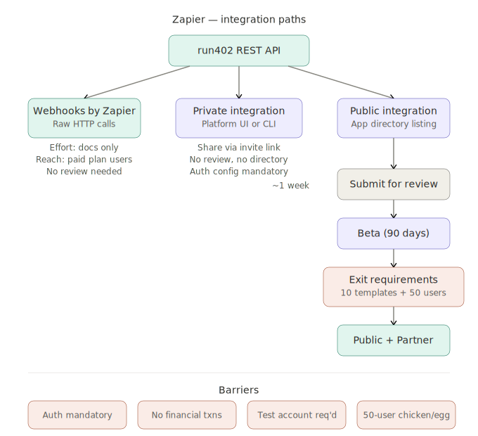
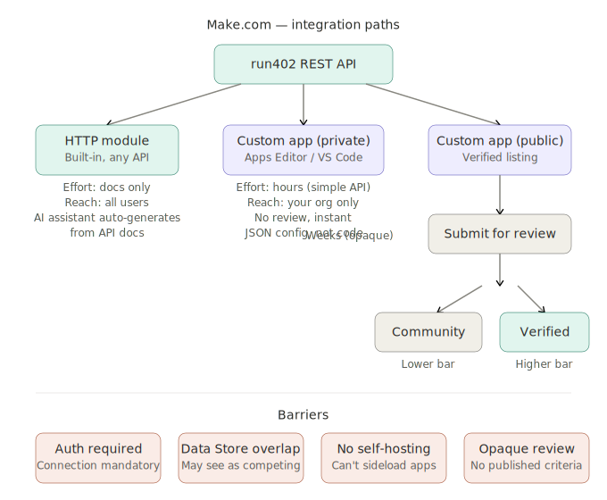
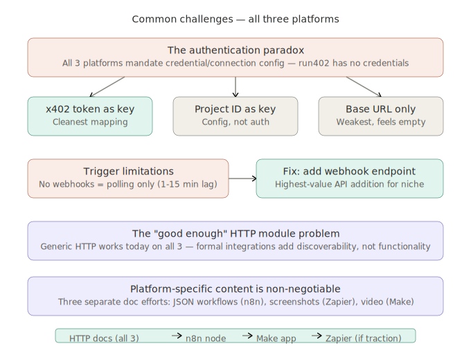

# Integrating run402 into Workflow Automation Platforms

## n8n, Zapier, and Make.com — Technical Integration Guide

**Date:** March 19, 2026

---

## 1. n8n

### How It Works

n8n is open-source, self-hostable, and the most architecturally open of the three platforms. It has three distinct integration paths, each with different reach and effort.

### Path A: HTTP Request Node (Day One)

The HTTP Request node is a built-in core node available to every n8n user on both self-hosted and cloud instances. No certification, no review, no npm package. The user drags the node onto the canvas, configures the method (POST/GET/PUT/DELETE), enters the run402 API URL, sets headers and body, and it works.

For AI agent workflows specifically, n8n has a variant called the HTTP Request Tool node. This is the same HTTP Request node but configured to be used as a "tool" by an AI Agent node. The agent can call it autonomously during reasoning — which is exactly the use case run402 is built for. The agent decides it needs persistent storage, calls the HTTP Tool node pointing at run402, provisions a backend, and writes data. No human in the loop.

**What you need to provide:**

- Clear REST API documentation (OpenAPI/Swagger spec preferred — n8n can auto-generate node configurations from these).
- Example n8n workflow JSON files that users can import directly. n8n's community shares workflows as JSON exports — this is the primary distribution mechanism.
- A tutorial showing how to wire the HTTP Request node to run402 for the most common operations: provision a project, create a table, insert data, query data.

**Effort:** Near zero. This works today if run402 has a REST API. The only work is documentation and example workflows.

**Reach:** 100% of n8n users (self-hosted and cloud).

### Path B: Community Node (Growth Play)

A community node is a TypeScript npm package that appears as a native node in n8n's node panel — with its own icon, its own configuration UI, and operations like "Create Project," "Insert Row," "Query Table" as dropdown selections. Users don't need to understand HTTP methods or construct JSON bodies.

**Build process:**

1. Scaffold the project using n8n's official CLI tool: `npm create @n8n/node@latest`. This generates the correct file structure, linting config, and build pipeline. n8n strongly recommends this for any node you plan to submit for verification.
2. Choose "declarative" style for a straightforward REST API wrapper (run402 fits this). Declarative nodes define operations as routing rules — method, URL, body template — without custom code. Choose "programmatic" only if you need complex multi-step logic.
3. Define a credentials file. This is where run402's zero-signup model creates a design decision. n8n expects a credentials type (API Key, Bearer Token, OAuth2, or custom). Options: (a) Define a minimal "API Key" credential that stores the run402 base URL and any project identifier, even if there's no traditional secret. (b) Define a custom credential type that just stores configuration (endpoint URL, default project). (c) If x402 payment tokens are involved, those become the credential. You cannot skip the credentials file entirely — n8n's architecture requires it for any node that makes external HTTP calls.
4. Define operations: Create Project, List Tables, Create Table, Insert Row, Query, Delete. Each operation maps to a REST endpoint.
5. Test locally with `npm run dev`, which spins up a local n8n instance with your node loaded.
6. Publish to npm with the package name starting with `n8n-nodes-` (e.g., `n8n-nodes-run402`).

**Unverified vs. Verified:**

Once published to npm, any self-hosted n8n user can install it manually via npm or through n8n's community node GUI. This is "unverified" — no review needed, but it won't appear on n8n Cloud.

To get on n8n Cloud (where a large portion of users are), you need verification:

1. Submit via the n8n Creator Portal (https://creators.n8n.io).
2. Requirements: no runtime dependencies (everything must be bundled at build time), pass the n8n linter, provide a README, provide a demo video showing the node working inside n8n.
3. Starting May 1, 2026 (weeks away), all community nodes must be published using a GitHub Action with a provenance statement. If you're building this now, set up the GitHub Action from the start.
4. n8n's team reviews the node. Timeline is not published — budget 2-6 weeks based on community reports.
5. On approval, the node appears in n8n Cloud's node panel under "More from the community."

**Effort:** Medium. A declarative community node for a clean REST API is a few days of work. The verification process adds a couple weeks of waiting.

**Reach:** Unverified = self-hosted only. Verified = self-hosted + cloud.

### Path C: Workflow Templates (Viral Content)

n8n has a workflow template gallery where users browse and import pre-built workflows. Publishing a "run402 Persistent Memory for AI Agents" template that shows a complete working workflow — trigger, AI Agent node, HTTP Tool calling run402, output action — is probably the single highest-leverage content marketing asset for this niche. Users import the template, swap in their own trigger, and they're running.

Templates are JSON files. You submit them through the n8n Creator Portal alongside your community node, or share them on the n8n community forum directly.

### Obstacles and Barriers

**Credentials architecture mismatch.** n8n's node system assumes every external service requires authentication credentials stored in n8n's credential manager. run402's zero-signup, no-credential model doesn't fit this pattern natively. The workaround — a credential type that just stores config rather than secrets — works but feels slightly off. If the x402 payment mechanism involves any token or identifier, that becomes the natural credential and the mismatch disappears.

**Competing with n8n's own features.** n8n has been building more built-in AI and data features, including memory nodes and data storage. Their verification policy explicitly states: "n8n reserves the right to reject nodes that compete with any of n8n's paid features, especially enterprise functionality." If n8n decides to offer built-in persistent storage or agent memory as a paid feature, they could reject a run402 community node. This is a business risk, not a technical one. Mitigation: position run402 as "external backend infrastructure" rather than "n8n storage" — the way Supabase or Postgres nodes are positioned.

**Self-hosted fragmentation.** n8n's self-hosted users run many different versions, Docker configurations, and environments. Community nodes that work on one setup may break on another. Stick strictly to the n8n-node CLI scaffolding and avoid any runtime dependencies to minimize this.

**Cloud limitations.** Unverified nodes cannot be installed on n8n Cloud at all. This means the HTTP Request node path (Path A) is actually the most reliable way to reach cloud users until verification is complete.

---

## 2. Zapier

### How It Works

Zapier is the largest platform by user count but the most restrictive for third-party developers. It has a formal developer platform with a structured build-review-publish pipeline. Everything routes through Zapier's infrastructure — there's no self-hosting, no npm packages, no open-source extensibility.

### Path A: Webhooks by Zapier (Day One)

Every Zapier user has access to the "Webhooks by Zapier" built-in app. This lets users send HTTP requests to any URL as an action step in a Zap. The user configures the method, URL, headers, and JSON body manually.

For receiving data back from run402 (e.g., query results), the user combines "Webhooks by Zapier" (to send the request) with Zapier's built-in JSON parsing to extract fields from the response.

**What you need to provide:**

- Step-by-step documentation showing how to configure a Webhook action pointing at run402's API for each operation (provision, write, read, query).
- Screenshots. Zapier's audience skews less technical than n8n's — visual guides matter more here.
- Pre-built Zap templates (even without a formal integration, you can share "how-to" content).

**Effort:** Documentation only. No code.

**Reach:** All Zapier users who are comfortable with Webhooks (power users — your target segment).

**Limitation:** Webhook steps count against Zapier's task quota and require a paid plan. Free-tier users can't use custom webhooks in multi-step Zaps.

### Path B: Private Integration (Early Adopters)

Zapier's Developer Platform lets you build an integration using either the Platform UI (browser-based visual builder) or the Platform CLI (local development, version control, CI/CD). A private integration is invite-only — you share it via a unique link, and only people with that link can add it to their Zapier account.

**Build process:**

1. Create an app at https://zapier.com/app/developer.
2. Configure authentication. Zapier requires one of: OAuth v2 (recommended), API Key, Basic Auth, or Session Auth. You cannot skip authentication — Zapier's architecture mandates it for every integration. For run402, the most natural fit is API Key auth where the "key" is whatever identifier or x402 token the user (or their agent) uses. If there is truly no authentication at all, you'd need to create a nominal auth step that just stores the run402 base URL — Zapier's test step will try to validate the connection, so you need an endpoint that returns a 200 to confirm the "connection" is valid.
3. Define Triggers (events from run402 that start a Zap): "New Row Added," "Project Created," "Query Result Available." Triggers require a polling endpoint or a webhook subscription mechanism. If run402 doesn't have event webhooks, you're limited to polling triggers — Zapier hits your API on a schedule and checks for new data.
4. Define Actions (things Zapier can do in run402): "Create Project," "Create Table," "Insert Row," "Run Query." Each action maps to an API endpoint with input fields the user fills in.
5. Define Searches (lookups): "Find Row by ID," "Find Project." Searches let downstream Zap steps reference run402 data.
6. Test each trigger, action, and search with real API calls.

**Effort:** Medium-high. Zapier's platform is more opinionated and less flexible than n8n's. Expect 1-2 weeks of development, more if the API doesn't cleanly map to Zapier's trigger/action/search model.

**Reach:** Anyone you share the invite link with. No discoverability beyond your own marketing.

### Path C: Public Integration (The App Directory)

Publishing your integration to Zapier's public app directory makes it discoverable to all Zapier users. This is the only path to broad Zapier distribution — there is no equivalent of n8n's npm install or Make's HTTP-module-with-a-template shortcut.

**Process:**

1. Complete all triggers, actions, and searches.
2. Click "Publish" in the Integration Home and fill out the submission form.
3. Zapier's team reviews within approximately one week and responds with any outstanding requirements.
4. On initial approval, your app enters **Beta** for 90 days.
5. During Beta, you must:
   - Publish help documentation for the integration on your own website.
   - Create and publish at least 10 Zap templates (pre-built example Zaps).
   - Attract 50 active users (users with a live, turned-on Zap using your integration). There is a waiver available if you embed Zapier in your own product behind a login.
6. After 90 days and meeting the requirements, the Beta tag is removed and you enter the Zapier Partner Program.

**After launch:** You can promote new versions without re-review. Zapier monitors integration health and will escalate bugs and feature requests. Unaddressed support issues can result in removal from the directory (requiring re-review to get back in).

**Effort:** High. The integration build itself is medium, but the 10-template + 50-active-user requirement is a significant go-to-market effort on top of the technical work. For a startup without an existing Zapier user base, hitting 50 active users in 90 days requires active marketing.

**Reach:** All Zapier users (millions).

### Obstacles and Barriers

**Mandatory authentication.** Zapier's architecture requires every integration to define an auth method. There is no "no auth" option. For run402's zero-signup model, this is a fundamental mismatch. You must create an auth step — even if it's just storing a URL — and provide a test endpoint that validates the "connection." This adds friction to exactly the workflow that's supposed to be frictionless.

**Financial transactions policy.** Zapier's publishing guidelines state that integrations cannot facilitate financial transactions. The x402 protocol involves micropayments for API usage. If Zapier interprets run402's pay-per-use model as facilitating financial transactions, the public integration could be rejected. Mitigation: frame run402 as "backend infrastructure with API-key-based access" and keep the payment mechanism invisible to Zapier (the user's x402 balance is managed outside Zapier, and the Zapier integration just makes API calls using a token). Don't expose any payment-related actions or triggers in the Zapier integration.

**Test account requirement.** Zapier requires a test account at `integration-testing@zapier.com` so their review team can test the integration. For a zero-signup service, you'd need to pre-provision a test environment that this email can access — which is philosophically at odds with the product but practically manageable.

**50 active users.** This is a chicken-and-egg problem. You can't get broad distribution without being in the directory, and you can't get in the directory without 50 active users. The Webhooks path (Path A) and the private integration path (Path B) are your tools for building that initial user base. The embed waiver (if you embed Zapier's UI in run402's product) is an alternative.

**Polling vs. webhooks for triggers.** If run402's API doesn't support webhook subscriptions (push notifications when data changes), triggers will be polling-based — Zapier hits the API every 1-15 minutes depending on the user's plan. This means "New Row Added" triggers aren't real-time. For AI agent workflows that expect immediate data availability, polling latency could be a problem. If run402 supports webhooks, this is a non-issue, but it's worth confirming.

**No code execution in Zaps for free users.** The "Code by Zapier" step (which enables custom logic like constructing dynamic API calls) requires a paid plan. Webhook steps also require paid plans for multi-step Zaps. This limits how many Zapier users can actually use a run402 integration to the paid tier — which, for your target segment of power users, is likely where they already are.

---

## 3. Make.com

### How It Works

Make.com (formerly Integromat) sits between n8n's openness and Zapier's gatekeeping. It has a visual scenario builder with branching, looping, and data transformation capabilities that exceed Zapier's linear Zap model. It also has a developer platform for building custom apps, plus a universal HTTP module.

### Path A: HTTP Module (Day One)

Every Make.com user has access to the built-in HTTP module, which can call any REST API. Like n8n's HTTP Request node, it requires manual configuration of method, URL, headers, and body. Make's HTTP module is slightly more powerful than Zapier's Webhook equivalent because it supports response parsing, pagination, and error handling natively.

Additionally, Make has an AI assistant that can auto-generate an HTTP module configuration from API documentation. If run402 provides clean, well-structured API docs (ideally with example request/response pairs), a Make user could paste them into the AI assistant and get a working module in seconds. This is a significant distribution shortcut that neither n8n nor Zapier offers in the same way.

**What you need to provide:**

- REST API documentation with clear endpoint descriptions and example payloads.
- Make.com-specific tutorials (Make's audience responds well to video walkthroughs).
- Example scenario blueprints. Make scenarios can be exported and shared as JSON blueprints — the equivalent of n8n's workflow templates.

**Effort:** Documentation only. No code.

**Reach:** All Make.com users.

### Path B: Custom App — Private (Team Use)

Make's Apps Editor (available in the browser and as a VS Code extension) lets you define a custom app with modules, connections, and RPCs (remote procedure calls for dynamic dropdowns). A private custom app is available only within your Make organization — no review, instant availability.

**Build process:**

1. Go to your Make profile → API access → create an API token with the required scopes.
2. Open the Apps Editor (browser) or install the Make Apps Editor extension in VS Code and configure it with your API token and zone URL.
3. Define a **Base** — the root configuration including the API base URL and default headers.
4. Define a **Connection** — the authentication configuration. Like Zapier, Make requires a connection type. Options: API Key, OAuth2, custom. Same design decision as Zapier — for run402, you'd likely define an API Key connection where the "key" is a project identifier or x402 token.
5. Define **Modules** — each module is an operation. Types: Action (write/modify), Search (lookup/query), Trigger (event-based). Each module specifies its HTTP request, input parameters (what the user fills in on the canvas), and output mapping (how the API response maps to downstream data).
6. Test in a scenario.

The VS Code extension enables local development with real-time sync to Make's backend, which is significantly better for iteration than the browser editor.

**Effort:** Low-medium. Make's documentation estimates a simple API Key auth app with a few action modules can be working in under an hour for a developer familiar with REST concepts. The JSON-based configuration format is straightforward.

**Reach:** Your Make organization only. Not discoverable by other users.

### Path C: Custom App — Public (Verified / Community)

To make your app available to all Make users, you submit it for review.

**Two tiers:**

1. **Community App** — available to other Make users but not officially supported by Make. Lower bar for approval.
2. **Verified App** — reviewed and verified by Make, available as part of the subscription, installed by default. Higher bar.

**Process:**

1. In the Custom Apps dashboard, navigate to your app and click "Request review."
2. Fill in the submission form.
3. Make's team reviews the app. Timeline is not published — community reports suggest several weeks, potentially longer.
4. Make only accepts public apps connecting to services not already covered by existing Make apps. Since run402 is a novel service, this shouldn't be a blocker — but if Make ever builds a native "AI backend" or "database provisioning" module, this could change.

**Effort:** Medium. The build is fast; the review wait is the bottleneck.

**Reach:** All Make.com users (for verified apps).

### Obstacles and Barriers

**Connection/auth requirement.** Same issue as Zapier. Make requires a connection definition for any custom app that makes HTTP calls. You must provide an authentication method. A "no auth" connection that just stores the base URL is possible but unconventional — Make's connection test will need an endpoint that returns success.

**JSON configuration format.** Make's custom app configuration is entirely JSON-based (not code). This is simpler than writing TypeScript (n8n) or using Zapier's CLI with JavaScript, but it's also less flexible. Complex logic (like dynamically constructing queries based on user input) requires Make's IML (Integromat Markup Language) — a templating language specific to Make. There's a learning curve for IML that doesn't transfer to other platforms.

**No self-hosting.** Unlike n8n, Make is cloud-only. There's no way to sideload a custom app for another Make user without going through either the private (organization-only) or public (reviewed) path. This means the HTTP module (Path A) is the only zero-friction path for users outside your organization.

**Review criteria are opaque.** Make's public app review criteria are less transparent than Zapier's or n8n's. The documentation says they review for quality and compliance but doesn't publish specific technical requirements or timelines. Community developers report inconsistent review experiences.

**Data Store overlap.** Make has a built-in feature called "Data Store" — a simple key-value/flat-table storage that persists between scenario runs. This is the exact toy-grade storage that the niche analysis document identifies as inadequate. However, Make might view a run402 integration as competing with Data Store, even though run402 is a full Postgres backend. How Make's review team interprets this overlap is unpredictable.

---

## 4. Common Challenges Across All Three Platforms

### The Authentication Paradox

Every platform requires integrations to define an authentication/connection mechanism. This is baked into their architectures — it's how they manage credential storage, connection testing, and user experience consistency. None of them offer a "no auth" integration type.

run402's zero-signup model means there is no traditional credential to store. This creates a design problem that must be solved the same way on all three platforms: invent a credential. The most natural approaches:

- **x402 payment token as API key.** If the user (or their agent) has any kind of token for interacting with run402, that token becomes the credential. This is the cleanest solution because it maps directly to the platforms' existing auth patterns.
- **Project identifier as credential.** If run402 uses project IDs to scope API calls, the project ID becomes the stored credential. This is slightly unusual (it's configuration, not authentication) but works mechanically.
- **Base URL as credential.** The weakest option — store only the run402 endpoint URL. All three platforms will try to "test" the connection by making a request to validate it, so you need a health-check endpoint that returns 200. This works but feels empty from the user's perspective ("I just saved a URL — what was the point?").

The broader issue: the credential setup step directly contradicts run402's "no friction" promise. A user on any of these platforms will see a modal asking them to "Connect to run402" before they can use the integration. This is one click and one field, but it is a step — and it's a step that doesn't exist when using the raw HTTP module. For power users who understand HTTP, the HTTP module with no connection step may actually be lower friction than the formal integration.

### Trigger Limitations

All three platforms support triggers (events that start a workflow). For a run402 integration, natural triggers would be "New Row Added," "Data Changed," or "Project Created." These triggers require one of two mechanisms:

- **Webhooks (push).** run402 registers a callback URL with the platform. When data changes, run402 sends a POST to that URL. This is real-time and preferred by all platforms. If run402 doesn't have a webhook/event subscription system, this isn't available.
- **Polling (pull).** The platform periodically hits a run402 endpoint and checks for new data. Zapier polls every 1-15 minutes depending on plan tier. Make polls based on scenario schedule. n8n polls based on cron configuration. Polling adds latency and generates API load even when nothing has changed.

If run402 doesn't currently support webhook subscriptions, triggers across all platforms will be polling-based. This is functional but suboptimal. Adding a webhook subscription endpoint (`POST /webhooks/subscribe` with a callback URL and event type) would significantly improve the integration story on all three platforms. This is probably the single highest-value API feature run402 could add specifically for the automation platform niche.

### The "Good Enough" HTTP Module Problem

On all three platforms, the built-in HTTP module (HTTP Request on n8n, Webhooks by Zapier, HTTP module on Make) already lets users call run402's API with zero development effort from your side. This creates a strategic question: does building formal integrations add enough value over HTTP to justify the effort?

Arguments for formal integrations:

- **Discoverability.** Users searching for "database" or "backend" in the platform's node/app panel will find run402 if there's a formal integration. They won't find it if the only path is "use the HTTP module and type in this URL." For users who don't already know about run402, the formal integration is the discovery mechanism.
- **Lower user effort.** A formal integration with dropdown operations ("Create Table," "Insert Row") is easier to use than manually constructing HTTP requests. The target niche includes semi-technical users on Zapier and Make who may not be comfortable hand-crafting JSON bodies.
- **Template/blueprint distribution.** Formal integrations enable official templates that appear in each platform's template gallery. These are high-conversion content assets.

Arguments against prioritizing formal integrations:

- **The target segment is power users.** Power users who build AI agent workflows are comfortable with HTTP modules. They may actually prefer the HTTP approach because it gives them full control over request construction.
- **Review timelines are unpredictable.** All three platforms have review processes that can take weeks. During that time, the HTTP module works immediately.
- **Maintenance burden.** A formal integration on each platform must be maintained — API changes require updates, platform changes require adaptation, user bug reports must be triaged. Three platform integrations is three maintenance surfaces.

**Recommended approach:** Start with HTTP documentation and example workflows/templates on all three platforms. Build a formal n8n community node first (most open ecosystem, most technical audience, most aligned with run402's agent-first model). Evaluate Zapier and Make formal integrations based on traction from the HTTP path.

### Platform-Specific Content Is Non-Negotiable

Each platform's user base consumes content in a specific format and location. Generic "here's our REST API docs" content won't drive adoption. What's needed:

- **n8n:** Importable JSON workflow files, posted on n8n's community forum and template gallery. Video showing the workflow running end-to-end. Community forum engagement answering storage-related questions.
- **Zapier:** Screenshot-heavy step-by-step guides. Zap templates (even if based on Webhooks rather than a formal integration). Blog posts targeting "Zapier persistent storage" searches.
- **Make:** Scenario blueprint JSON files. Video tutorials (Make's community is video-oriented). Potential submission to Make's community template gallery.

This is three separate documentation and content efforts, not one effort published three ways.

### Review Rejection Risk

All three platforms reserve the right to reject integrations. The specific risks for run402:

| Risk | n8n | Zapier | Make |
|---|---|---|---|
| Competes with platform feature | Medium (n8n building storage features) | Low (Zapier doesn't offer databases) | Medium (Make Data Store overlap) |
| Financial transaction concerns | Low (open-source, less restrictive) | High (explicit policy against it) | Low (no stated policy) |
| Auth model too unconventional | Low (community nodes are flexible) | Medium (strict auth requirements) | Medium (connection required) |
| Review timeline | 2-6 weeks estimated | ~1 week to first response, 90 days Beta | Several weeks, unspecified |

The safest first move is n8n, where the open-source ethos and technical audience align most naturally with run402's model. Zapier carries the most risk due to the financial transactions policy and 50-user requirement. Make is middle-ground — lower barriers than Zapier but less community-driven than n8n.

### Version Management Across Platforms

Once you have formal integrations on multiple platforms, API changes to run402 must be propagated to all of them. Each platform has its own versioning system:

- **n8n:** New npm version, users update via npm or n8n's UI.
- **Zapier:** Version promotion in the Platform UI. No re-review needed for updates after initial approval.
- **Make:** Update via Apps Editor, no re-review for minor changes (unconfirmed for major changes).

Breaking API changes (renamed endpoints, changed response shapes) require coordinated updates across all platforms. Non-breaking additions (new endpoints, new optional fields) are generally safe to add to the API without immediately updating platform integrations.
